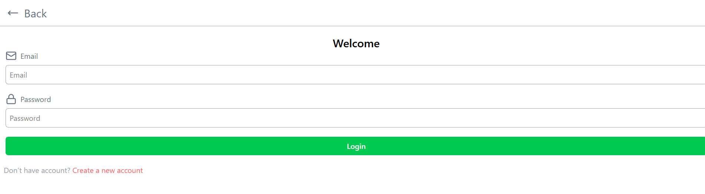
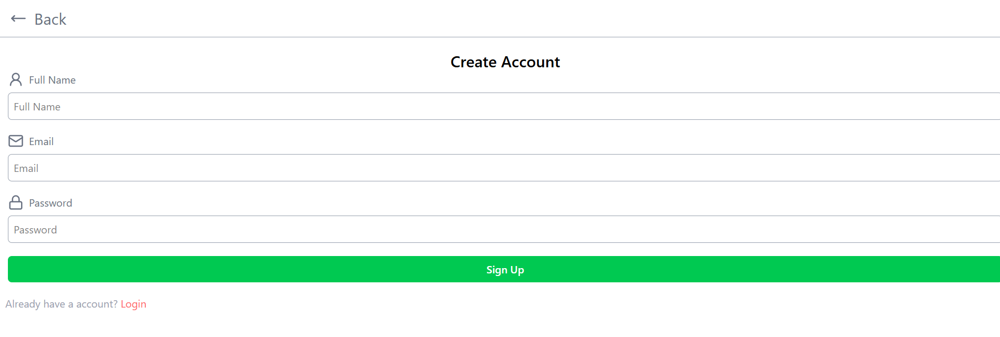
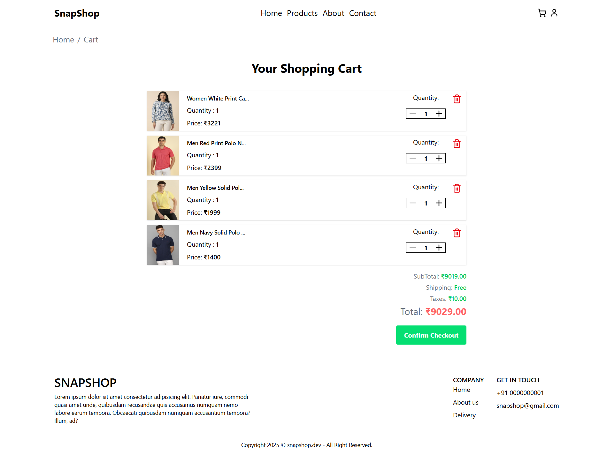
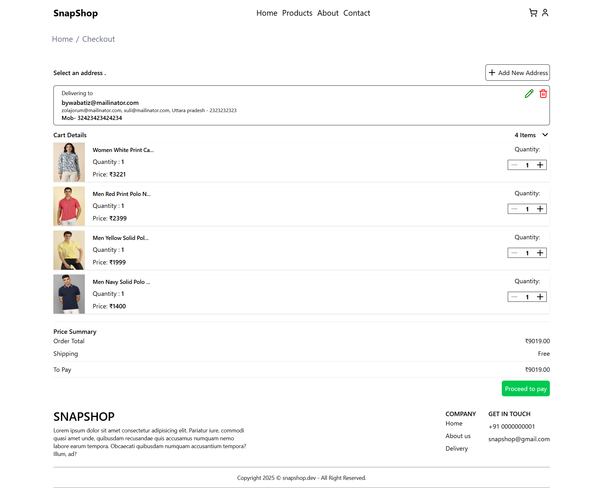
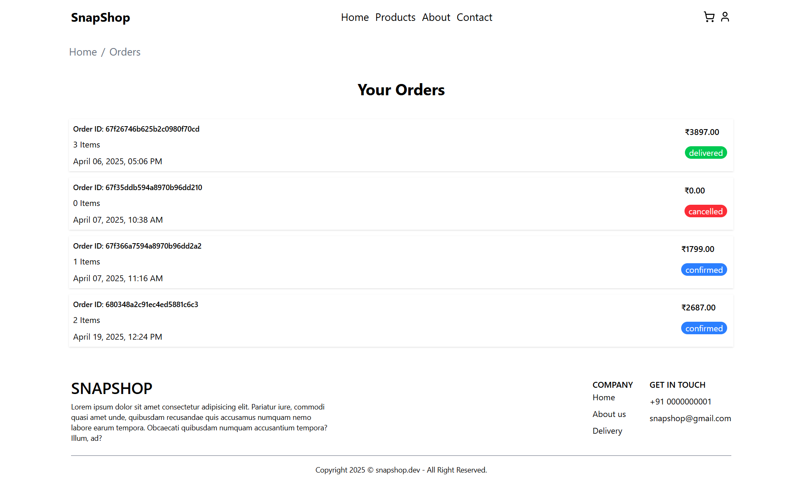
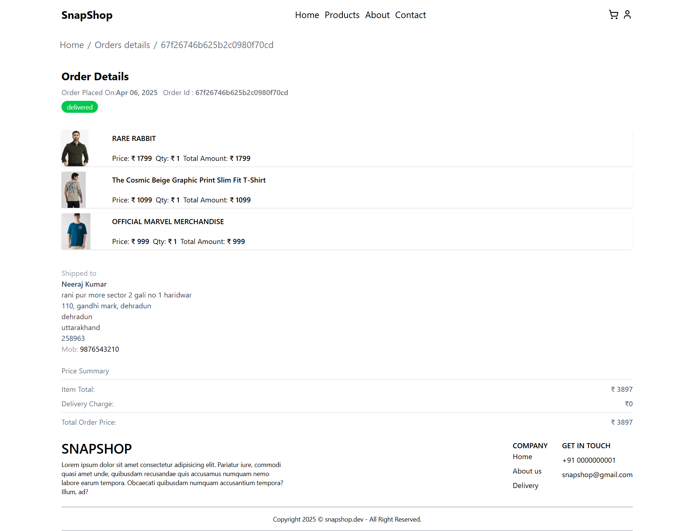
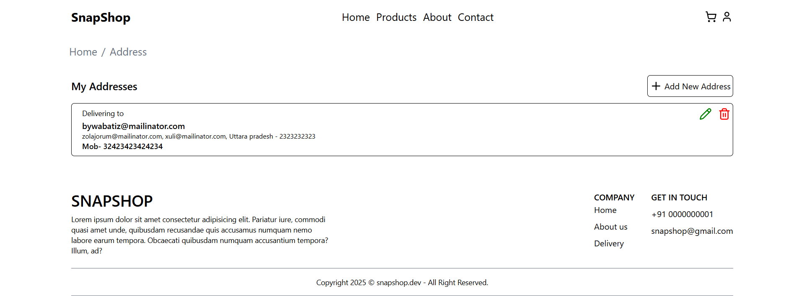
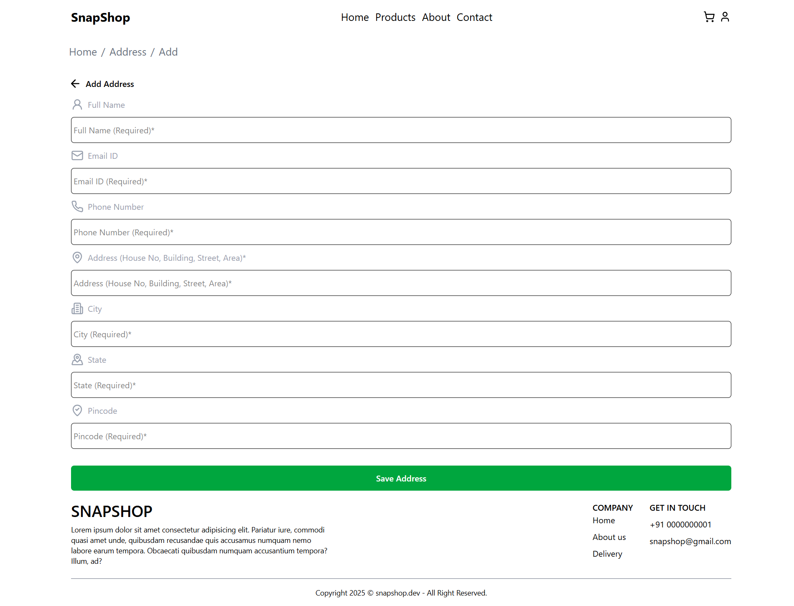
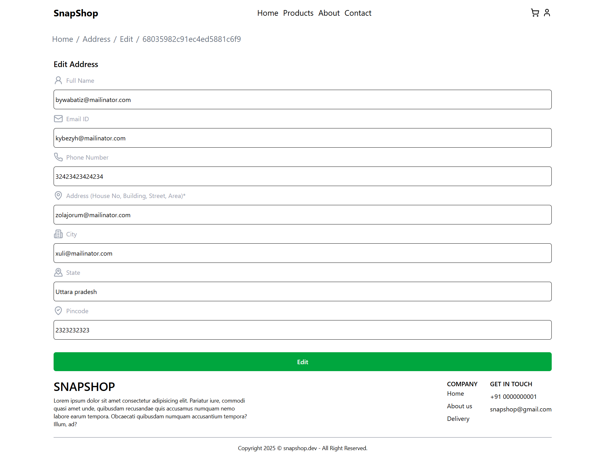

 # 🛍️ SnapShop

 **SanpShop** is a modern ecommerce frontend built with React. This project includes a clean UI, responsive design, and  features like product listing, search, cart, and more 

 ---

 ### 🚀 Features

 - 🖼️ Product listing with categories
 - 🛒  Add to cart functionality
 - 🔍Real time product search
 - 📱Fully responsive UI

--- 

## 🛠️ Tech Stack

    
- **Frontend:** React.js, React Router
- **Styling:** Tailwind CSS
- **Deployment:** Netlify


 
---

## 📦 Installation

Clone the repo and install dependencies:

```bash
git clone https://github.com/neerajkumar002/SnapShop.git
cd SnapShop
npm install

```

## Start development

```bash
 npm ruun dev

```

## Languages & tools

- Vite
- React
- Node


## 🌐 Live Demo
[View SnapShop Live](https://snapmyshop.netlify.app/)


## 📸 Screenshots 













## 🙋‍♂️ Author
### Neeraj Kumar
- 🌐 Portfolio: [Link](https://neerajkumar-dev.netlify.app/)